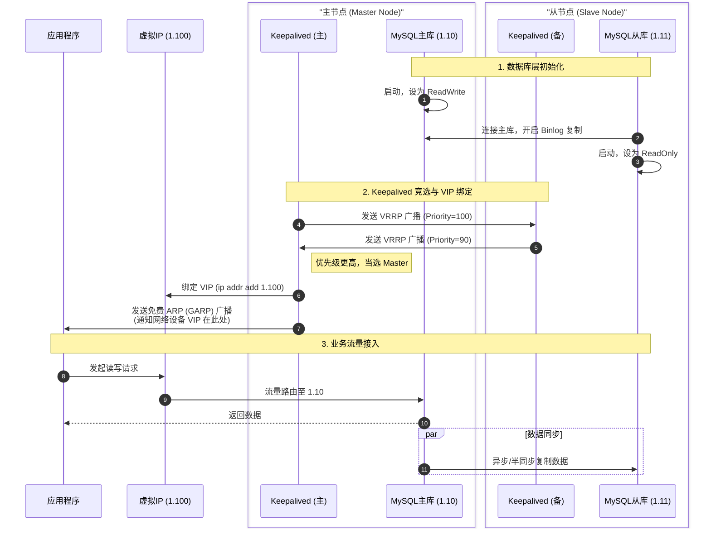
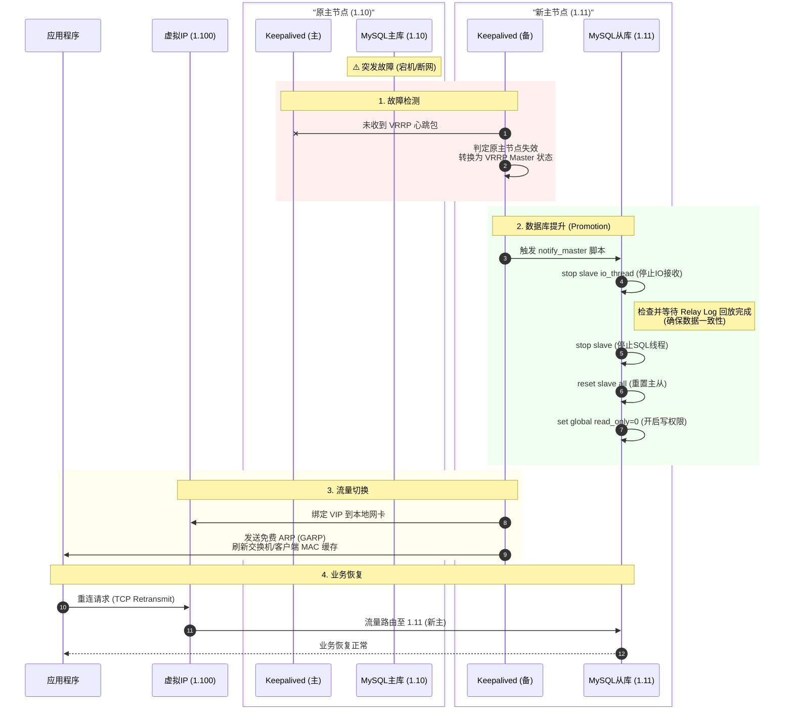
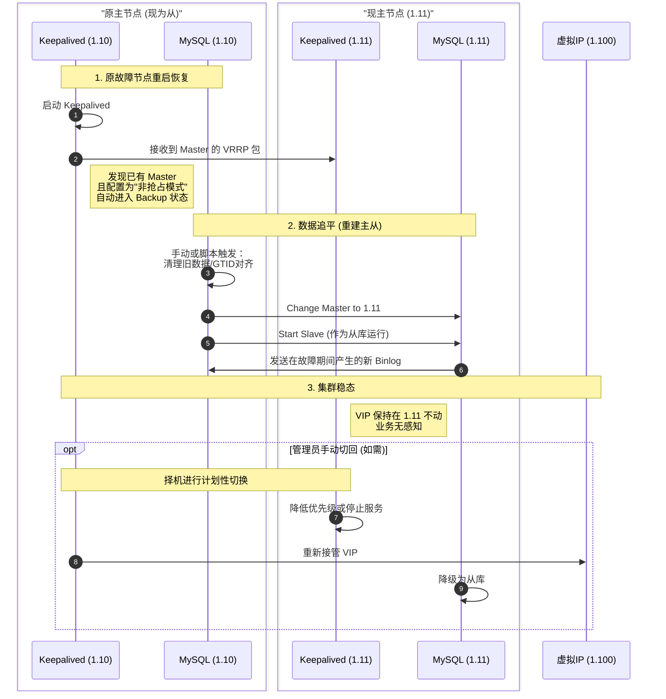

这是一个非常经典的**高可用（High Availability）**架构场景。

为了让图表更具技术深度和指导意义，我建议将 `Keepalived集群` 拆分为 `KA_Master`（运行在主库机器上的 Keepalived）和 `KA_Slave`（运行在从库机器上的 Keepalived），这样能更清晰地展示 VRRP 协议的交互和 VIP 的漂移过程。

以下为您完善的三个阶段的 Mermaid 时序图：

### 1. 启动与正常运行流程 (Startup & Normal State)

在这个阶段，重点展示主从复制关系的建立、VIP 的绑定以及应用程序的正常访问。

代码段

------

### 2. 故障切换流程 (Failover Flow)

这是核心流程。重点展示 Keepalived 如何检测故障、VIP 如何漂移（Drift）、以及从库如何提升为主库（Promotion）。

代码段

------

### 3. 故障恢复与节点重加 (Recovery & Re-join)

这是很多设计容易忽略的地方。**注意**：通常我们配置 Keepalived 为 `nopreempt`（不抢占）模式。原主库恢复后，**不应立即抢回 Master 地位**，否则会导致数据不一致和二次业务抖动。它应该先作为“从库”加入集群。

代码段

### 给您的优化建议

1. **GARP (Gratuitous ARP) 是关键**：在图表中我特意加入了 `发送免费 ARP` 这一步。这是 VIP 漂移生效的关键，它强制更新交换机和客户端的 ARP 缓存，否则应用程序可能仍然试图向旧的 MAC 地址发送数据。
2. **明确“提升”动作**：在切换流程中，`Slave` 变为 `Master` 不是自动发生的，必须由 Keepalived 调用脚本（`notify_master`）去执行 SQL 命令（如关闭 read_only），这一点在图中已体现。
3. **防止“脑裂”**：恢复流程中，原主库回来后，如果不处理，可能会出现两个主库（双写）。因此流程图强调了**“原主库作为从库加入”**这一逻辑。

您想针对其中某个特定脚本（比如 Keepalived 的检测脚本）进行详细讨论吗？